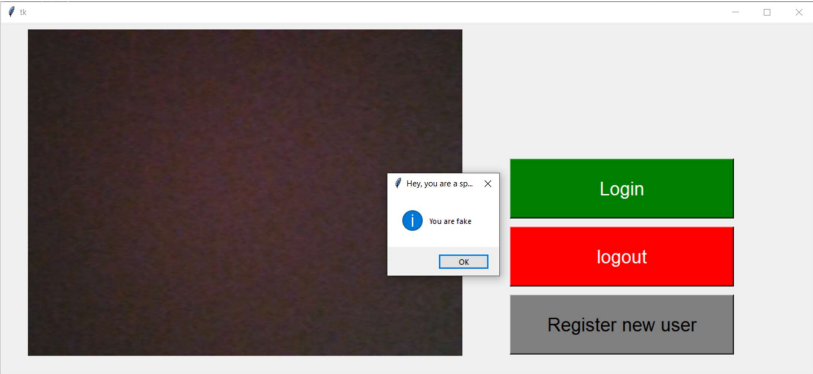

# Face_Recognition_and_Attendence

Face attendance system using face recognition with Python!

## Face attendance software

## Introduction

Welcome to the Face Recognition and Attendance Project repository! This project aims to provide a solution for automating attendance tracking in various settings, such as classrooms, offices, and events, using facial recognition technology.

Attendance tracking is a common task that can be time-consuming when done manually. With the help of facial recognition, this project offers a more efficient and accurate way to record attendance. The system can identify individuals by analyzing their facial features and match them against a pre-defined database, thus streamlining the attendance-taking process.

## Technologies

The project is built using the following technologies:

- Python
- OpenCV
- Dlib
- React.js (for the web interface)

## execution

- Python 3.11

### windows

In Windows, you will need to do a couple of additional steps before starting with this tutorial:
- Install the packages in requirements_windows.txt.

### linux, mac

- Install the packages in requirements_windows.txt except cmake & dlib

## spoofing feature

    git clone https://github.com/computervisioneng/Silent-Face-Anti-Spoofing.git
    pip install -r Silent-Face-Anti-Spoofing/requirements.txt

Remember to add the Silent-Face-Anti-Spoofing directory to your **PYTHONPATH**.

## web app

Face attendance + face recognition web app with React and Python!

The code for this project is available [here](https://github.com/kady2023/face-attendence-react-python-web-app).

Thank you for checking out the Face Recognition and Attendance Project repository! We hope this system helps streamline attendance tracking in your setting. If you have any questions or encounter issues, please feel free to open an issue in this repository or contact us.

Happy coding! 😄👋
